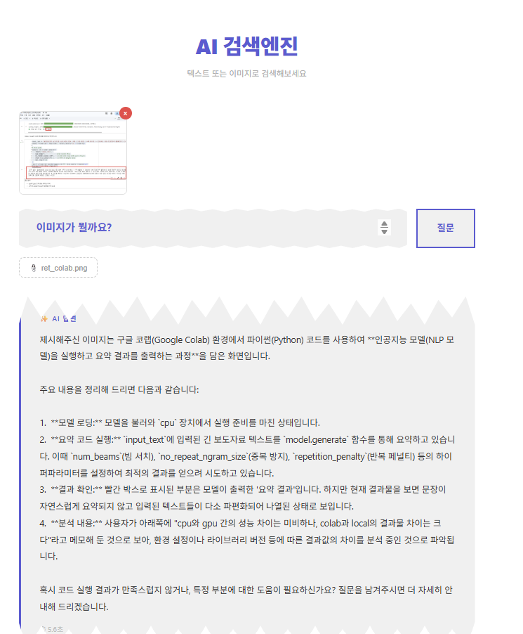

1.  backend : django-DRF /SwaggerUI

```
python manage.py runserver
```

2.  frontend : react

```
cd my-search
npm start
```

3.  DB : sqlite3
4.  LLM : gemini-3.1-flash-lite
5.  검색엔진 : fastAPI

```
uvicorn main:app --reload
```

# 업무관리

1. fastAPI - sqlite 저장 확인
2. LLM api_key 연결이 차후 업무
3. 

# 구조

```
views.py       → 요청/응답 처리 (교통 정리)
search_engine.py → AI 핵심 로직 (실제 일꾼)
models.py      → 데이터 구조 (DB 설계)
serializers.py → 데이터 변환 (입출력 형식)
```
